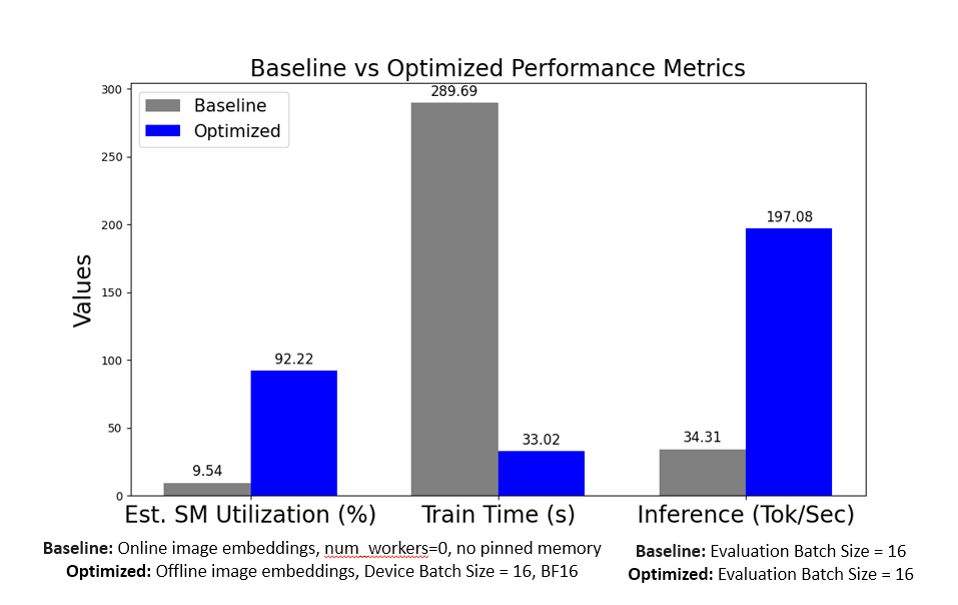

# HPML Final Project: [Project Title]

> **Course:** High Performance Machine Learning
> **Semester:** Spring 2026
> **Instructor:** Dr. Kaoutar El Maghraoui

---

## Team Information

- **Team Name:** [Nano-LLaVa: Training Pipeline Optimization of LLM Extended for Image Captioning (Team 36)]
- **Members:**
  - Alexander Swartz (as7629)

## Submission

- **GitHub repository:** [https://github.com/AlexanderSwartz/nano-llava](https://github.com/AlexanderSwartz/nano-llava)
- **Final report:** [`deliverables/HPML_Final_Report.pdf`](deliverables/HPML_Final_Report.pdf)
- **Final presentation:** [`deliverables/HPML_Final_Presentation.pptx`](deliverables/HPML_Final_Presentation.pptx)
- **Experiment-tracking dashboard:** [https://wandb.ai/as7629-columbia-university/Multimodal-Nanochat/table?nw=nwuseras7629](https://wandb.ai/as7629-columbia-university/Multimodal-Nanochat/table?nw=nwuseras7629)

---

## 1. Problem Statement

A 2–4 sentence description of the workload, the system being optimized, and *why* the optimization matters. State whether you are targeting **training**, **inference**, or **both**, and identify the bottleneck (compute, memory bandwidth, I/O, communication, etc.) you set out to address.

This project seeks to optimize the training pipeling of an LLM extended for image captioning. The goal is to leverage a pre-trained vision encoder and pre-trained LLM, optimizing a minimal projection layer between them. Optimizations mainly focused on the training pipeline (dataloading, mixed precision, batching), while minor inference optimizations and hyperparameter tuning were also conducted. 


---

## 2. Model/Application Description

Briefly describe the model(s) and stack you used:

- **Model architecture:**
	- **CLIP Vision Encoder**
		* Model: ViT-B/32 (Vision Transformer Base, patch size 32)
		* Parameters: 151M
		* Library: Hugging Face transformers
	- **Nanochat**
		* Architecture: Decoder-only transformer (“GPT from scratch”)
		* Parameters: 561M
		* Details: Loaded weights from smaller, d20 version (20 layers)
		* Source: Open-source repo for “hackability”
	- **all-MiniLM-L6-v2**
		* Description: Distilled transformer for semantic similarity test
		* Parameters: 22.7M
		* Library: Hugging Face transformers

- **Framework:** PyTorch 2.x / JAX / TensorFlow / vLLM / TGI.
- **Dataset:** name, size, license, and link.
- COCO Captions train and val 2017
- 123,287 images, ~ 5 captions each = 616,767 samples
- No Test Set (focus on training pipeline, not hyperparameter tuning)
- 591,753 training, 25,014 validation
- License for each image included in metadata
- http://images.cocodataset.org
- **Custom layers or modifications:**
The following files were already part of the orignal nanochat repo and were adapted for Nano-LLaVa:
  - **chat_sft.py** 
    - Added full image captioning training pipeline and optimization settings support
    - Implemented handling both online and offline image embeddings
    - Refined built-in dataloader to support new image-prompt-caption format
    - Added sentence transformer for validated caption quality
  - gpt.py
    - Added linear projection layer from image embeddings to nanochat vocab space
    - Modified forward to use image embeddings in input
    - Added new linear layer to existing optimizer hooks
  - engine.py
    - Added image captioning to inference capability while maintaining support for batched decoding
  - checkpoint_manager.py
    - Handles pre-trained weights and my saved weight checkpoints
  - loss_eval.py
    - Calls new forward function with image embeddings
- **Hardware target:** NVIDIA L4, g2-standard-4 (4 vCPUs, 16 GB Memory)

---

## 3. Final Results Summary

Replace the numbers below with your measured values. Add or remove rows to fit your study.

| Metric                       | Baseline | Optimized | Δ (Improvement) |
| ---------------------------- | -------- | --------- | --------------- |
| Top-1 Accuracy / Task Metric | XX.XX%   | XX.XX%    | ±X.XX pp        |
| Inference Latency (p50)      | XX.XX ms | XX.XX ms  | XX% faster      |
| Inference Throughput         | XXX tok/s| XXX tok/s | XX× higher      |
| Training Time / Epoch        | XX s     | XX s      | XX% faster      |
| Peak GPU Memory              | XX GB    | XX GB     | XX% less        |
| Model Size on Disk           | XX MB    | XX MB     | XX% smaller     |
| Energy / Sample (optional)   | X.XX J   | X.XX J    | XX% less        |

| Setting | Baseline | Optimized | Δ (Improvement) |
| :--- | :--- | :--- | :--- |
| **Pinned Memory** | False | True | Enabled (Faster Transfer) |
| **Persistent Workers** | False | True | Enabled (Lower Overhead) |
| **Num Workers** | 0 | 4 | 4x Increase |
| **Time of Image Embedding Computation** | Online | Offline | Pre-computed (Zero Runtime Cost) |
| **Device Batch Size** | 16 | 16 | - (No Change) |
| **Learning Rate** | 1e-4 | 1e-2 | 100x Increase |
| **Precision** | FP32 | BF16 | 50% Bit-width (Memory Savings) |
| **Training Iterations** | 1,000 | 500 | 50% Fewer Steps |
| **Evaluation Batch Size** | 8 | 16 | 2x Throughput |

**Hardware:** [NVIDIA L4, g2-standard-4 (4 vCPUs, 16 GB Memory), CUDA 12.4, Python 3.10, Pytorch 2.6.0+cu124, M129, Debian 11
]

**Headline result (one sentence):** *e.g., "Applying LoRA + 4-bit quantization reduced fine-tuning memory from 38 GB to 9 GB and cut wall-clock training time per epoch by 2.7× on a single A100, with no measurable accuracy degradation on the GLUE benchmark."*

---

## 4. Repository Structure

```
├── README.md
├── CLIP_COCO_loader.ipynb
├── ENV_SETUP.md
├── HPML_Final_Project_Presentation_as7629.pptx
├── HPML_Mid_Report_Group2.pptx
├── HPML_README_Template-1.md
├── README.md
├── chat_sft_command.txt
├── demo_command.txt
├── nanochat
│   ├── LICENSE
│   ├── README.md
│   ├── nanochat
│   │   ├── checkpoint_manager.py
│   │   ├── common.py
│   │   ├── core_eval.py
│   │   ├── dataloader.py
│   │   ├── dataset.py
│   │   ├── engine.py
│   │   ├── execution.py
│   │   ├── flash_attention.py
│   │   ├── fp8.py
│   │   ├── gpt.py
│   │   ├── logo.svg
│   │   ├── loss_eval.py
│   │   ├── optim.py
│   │   ├── report.py
│   │   ├── tokenizer.py
│   │   ├── ui.html
│   │   └── vision.py
│   ├── runs
│   │   ├── miniseries.sh
│   │   ├── runcpu.sh
│   │   ├── scaling_laws.sh
│   │   └── speedrun.sh
│   ├── scripts
│   │   ├── base_eval.py
│   │   ├── base_train.py
│   │   ├── chat_cli.py
│   │   ├── chat_eval.py
│   │   ├── chat_rl.py
│   │   ├── chat_sft.py
│   │   ├── chat_web.py
│   │   ├── tok_eval.py
│   │   └── tok_train.py
│   ├── tasks
│   │   ├── arc.py
│   │   ├── common.py
│   │   ├── customjson.py
│   │   ├── gsm8k.py
│   │   ├── humaneval.py
│   │   ├── mmlu.py
│   │   ├── smoltalk.py
│   │   └── spellingbee.py
│   ├── tests
│   │   ├── test_attention_fallback.py
│   │   └── test_engine.py
│   └── uv.lock
└── scripts
    ├── analyze_wandb_runs.ipynb
    ├── check_missing_embeddings.py
    ├── generate_jsonl.py
    ├── split_jsonl.py
    ├── update_wandb_run.ipynb
    └── wandb_add_hot_time.py
```

---

## 5. Reproducibility Instructions

### A. Environment Setup

```bash
# Clone
git clone https://github.com/AlexanderSwartz/nano-llava.git
cd nano-llava

# Follow nanochat env setup
cd nanochat
pip install uv
uv sync --extra gpu
source .venv/bin/activate
```

If you get errors throughout the setup, it can be due to GCP trying to use Anaconda. It can help to run `conda deactivate` and then follow the nanochat env setup with `uv` again.


**System requirements:** This project was only tested with a Google Cloud NVIDIA L4, g2-standard-4 (4 vCPUs, 16 GB Memory), Google, Deep Learning VM with CUDA 12.4, M129, Debian 11, Python 3.10. See `requirements.txt` for pinned package versions.

### B. Experiment Tracking Dashboard

Public experiment-tracking dashboard with training and evaluation metrics, system profiling, and baseline vs. optimized comparisons:

> **🔗 Dashboard:** https://wandb.ai/as7629-columbia-university/Multimodal-Nanochat/table?nw=nwuseras7629
>
> *Platform used:* Weights & Biases

Verify the link opens in an incognito browser. The dashboard includes a curated **report** that walks through the optimization story. If your platform does not support public links (e.g., self-hosted MLflow), a static export is committed under `results/dashboard/` instead.

### C. Dataset

download COCO annotations and images, storing them under COCO_data/
```bash
scripts/download_COCO.sh
```
The dataset is *not* committed to the repository. The script fetches it from http://images.cocodataset.org

- Licenses:
  - Annotations: CC BY 4.0.  
  - Images: Flickr Terms of Use

Convert the COCO annotations into the correct jsonl format expected for SFT
```bash
python scripts/generate_jsonl.py --split train
python scripts/generate_jsonl.py --split val
```

#### Precompute image embeddings for validation data:

```bash
python scripts/CLIP_COCO_loader.py --images-dir COCO_data/val2017 \
        --ann-file COCO_data/annotations/captions_val2017.json \
        --save-dir COCO_data/embeddings_val
```

### D. Training


To reproduce the baseline, you do not need to embed the images first.
(takes ~15 mins)
```bash
cd nanochat
python -u -m scripts.chat_sft --config ../chat_sft_configs/baseline_train.yaml
```

#### Precompute image embeddings for training data:
To reproduce the optimized run, you need to embed the training images first. This will take ~25 mins
```bash
python scripts/CLIP_COCO_loader.py --images-dir COCO_data/train2017 \
        --ann-file COCO_data/annotations/captions_train2017.json \
        --save-dir COCO_data/embeddings_train
```

Now you can actually train with the pre-computed image embeddings. Note that this run only trains for 30 iterations to prove optimization of training pipeling. To train for optimized caption quality, use optimized_train_full.yaml (takes 50 mins instead of 1.5 mins)

```bash
cd nanochat
python -u -m scripts.chat_sft --config ../chat_sft_configs/optimized_train_pipeline.yaml
```

### E. Evaluation
First, load my pre-trained weights from HF:
`hf download alexanderswartz/Nano-LLaVa --local-dir ~/.cache/nanochat/chatsft_checkpoints/d20/`

Now run --eval-only mode to generate captions using the validation data:

```bash
cd nanochat
python -u -m scripts.chat_sft --config ../chat_sft_configs/inference_demo.yaml
```

### F. Profiling

To regenerate the profiler traces referenced in the report:

```bash
# example of regenerating profiling for optimized run:
python -u -m scripts.chat_sft --config ../chat_sft_configs/optimized_train_pipeline_profiler.yaml
# will dump output .json (~1GB) to profiler_logs/
```

### G. Quickstart: Reproduce the Headline Result
Follow the 
Reproducing optimized training pipelin run requires [pre-computing the image embeddings first](#precompute-image-embeddings-for-training-data) (~25 mins) by following the previous steps. For reproducing the values used in headline results (~1.5 mins):
 ```bash
python -u -m scripts.chat_sft --config ../chat_sft_configs/optimized_train_pipeline.yaml
```
To actually use optimized hyperparameters and train for best caption quality (~50 mins)
 ```bash
python -u -m scripts.chat_sft --config ../chat_sft_configs/optimized_train_pipeline.yaml
```

To reproduce the optimized inferencing using my pre-trained weights, follow the [Evaluation section](#e-evaluationEvaluation)


---

## 6. Results and Observations

This project validated the architectural approach of the LLaVa model while providing a methodology for optimizing the training pipeline to fine-tune an LLM for image-captioning. The training pipeline was improved from GPU-starved to GPU-saturated by offloading image embeddings and AMP-driven batch size tuning. Minor hyperparameter tuning also confirmed a stable training setting. Compared to the unoptimized baseline, the final pipeline leveraged online image embeddings and mixed-precision to provide a 82.68% increase in SM utilization and 8.77x speedup in training time. Inference batch size optimization provided a 5.75x increase in tokens/sec. These results establish that with an optimized data and memory pipeline, extending an LLM for image captioning can be done with consumer-grade hardware.

- *Optimization 1 (Pre-computing image embeddings offline):* 8.77x speedup in training time, attributable to the decrease in dataloader bottleneck that was occuring from computing each image embedding during the forward pass while training .
- *Optimization 2 (AMP-Driven Batch Optimization):* 51.83% increase in tok/sec from FP32->BF32, attributable to the reduction in Peak VRAM Memory and nearly halved H2D transfer times.
- *Optimization 3 (Batched Decoding):* 5.74x throughput gain at batch size 16, attributable to the parallelization of caption generation.  
- *Device Batch Size Optimization:* This optimization did not decrease training time or increase throughput due to its accompanying increase in Peak GPU VRAM, which coincided will longer backwards passes. This was potentially due to the larger memory requirements of the activations and cache spilling.



---

## 7. Notes

- The nanochat repo was cloned under `nanochat/`. The modified script for training Nano-LLaVa is `nanochat/scripts/chat_sft.py` and its configurations are under `chat_sft_configs/`. Custom scripts for this project are under `scripts/`.
- My trained checkpoints are stored in alexanderswartz/Nano-LLaVa — see `docs/checkpoints.md`.


### AI Use Disclosure

*Per the HPML AI Use Policy (posted on CourseWorks). Required for every submission.*

**Did your team use any AI tool in completing this project?**

- [ ] No, we did not use any AI tool.
- [ ] Yes, we used AI assistance as described below.

**Tool(s) used:** *e.g., ChatGPT, Claude, GitHub Copilot, Cursor*

**Specific purpose:** *e.g., debugged a CUDA OOM error, clarified SM occupancy, polished prose in the report's introduction*

**Sections affected:** *e.g., src/profile.py setup, README §6 results narrative, report §V Discussion*

**How we verified correctness:** *e.g., re-ran every reported experiment ourselves; confirmed profiler-trace interpretations against the raw traces in results/; rewrote AI-suggested code in our own words and confirmed it produces the same numbers as the version we hand-wrote.*

By submitting this project, the team confirms that the analysis, interpretations, and conclusions are our own, and that any AI assistance is fully disclosed above. The same disclosure block appears as an appendix in the final report.

### License

Released under the MIT License. See [`LICENSE`](LICENSE).

### Citation

If you build on this work, please cite:

```bibtex
@misc{Nano-LLaVa2026hpml,
  title  = {Nano-LLaVa: Training Pipeline Optimization of LLM Extended for Image Captioning},
  author = {Swartz, Alexander},
  year   = {2026},
  note   = {HPML Spring 2026 Final Project, Columbia University},
  url    = {https://github.com/AlexanderSwartz/nano-llava}
}
```

### Contact

Open a GitHub Issue or email *[as7629@columbia.edu]*.

---

*HPML Spring 2026 — Dr. Kaoutar El Maghraoui — Columbia University*
